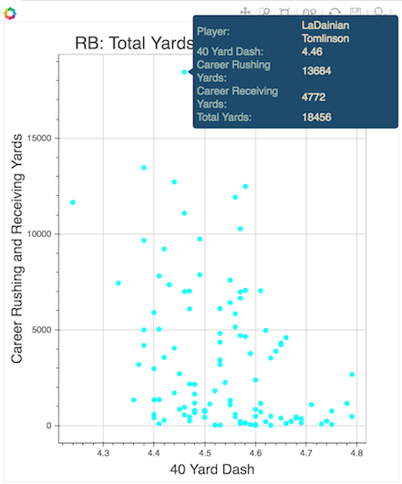

# NFL Combine Evaluation Plots
collaborators: Long Chen, Melaku Dubie, Rich Lee and Kivan Polimis
 

## Interactive plotting
Press the [ link to open a jupyter notebook directory window.
Select plots.ipynb to start an interactive notebook that plots the relationship between assorted Combine
metrics (40 time, vertical, speed score, etc.) and total yards in a NFL career for quarterbacks, running backs and wide receivers. 

Below each metric-specific plot is an explanation of the metric, the goal of the combine test, and a short discussion about variation between positions. LaDainian Tomlinson (highlighted player in example), is an elite running back that demonstrates a strong observed positional relationship between combine metrics and career performance: 

> There appears to be a slight negative relationship between 40 time and yardage for running backs indicating that faster running backs are more likely to have more productive careers. In contrast, there does not appear to be any clearly discernable relationship between yardage and 40 time for wide receivers or quarterbacks, suggesting that success for these positions may be more dependent on other characteristics such as skill, intelligence, or agility. 

Hovering over an individual point on the plot reveals the following information: player name, result in the selected metric, and a combination of career rushing, receiving and passing yards depending on the player's position (selected by changing the tabs in the plot's upper left). Plots can also be zoomed in/out, saved, etc.

## Additional Information
### Data sources
Passing, rushing and receiving data for individual seasons:  
[Pro-football reference](http://www.pro-football-reference.com/years/2015/passing.htm)  
Scouting combine and player database:  
[NFL savant](http://www.nflsavant.com/about.php)  

This repository is for notebooks created in our [NFL Combine Evalution Repository](https://github.com/kpolimis/nfl-combine-evaluation)
project that evaluates the relationship between pre-draft Combine metrics and career NFL performance
