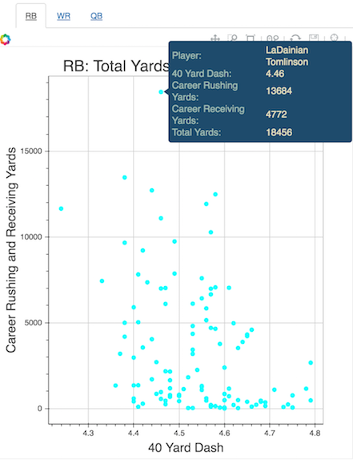

# NFL Combine Evaluation
collaborators: Long Chen, Melaku Dubie, Rich Lee and Kivan Polimis
 

## Interactive plotting
Press the  link to open a jupyter notebook directory window.
Select plots.ipynb to start an interactive notebook that plots the relationship between assorted Combine
metrics (40 time, vertical, speed score, etc.) and total yards in a NFL career for quarterbacks, running backs and wide receivers

## Data sources
Passing, rushing and receiving data for individual seasons:  
[Pro-football reference](http://www.pro-football-reference.com/years/2015/passing.htm)  
Scouting combine and player database:  
[NFL savant](http://www.nflsavant.com/about.php)  

This repository is for notebooks created in our [nflPlayerPerformance](https://github.com/kpolimis/nflPlayerPerformance)
project that evaluates the relationship between pre-draft Combine metrics and career NFL performance
